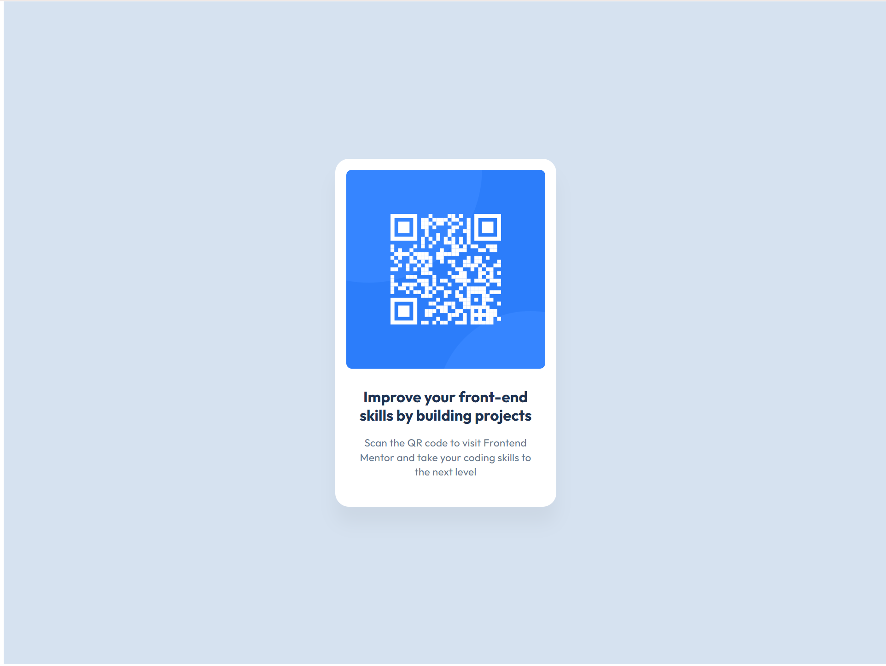

# Frontend Mentor - QR code component solution

This is a solution to the [QR code component challenge on Frontend Mentor](https://www.frontendmentor.io/challenges/qr-code-component-iux_sIO_H). Frontend Mentor challenges help you improve your coding skills by building realistic projects.

## Table of contents

- [Overview](#overview)
  - [Screenshot](#screenshot)
  - [Links](#links)
- [My process](#my-process)
  - [Built with](#built-with)
  - [What I learned](#what-i-learned)
  - [Continued development](#continued-development)
- [Author](#author)

## Overview

### Screenshot



### Links

- Solution URL: [Add solution URL here](https://your-solution-url.com)
- Live Site URL: [Add live site URL here](https://your-live-site-url.com)

## My process

### Built with

- Semantic HTML5 markup
- CSS custom properties
- Flexbox
- Mobile-first workflow
- [React](https://reactjs.org/) - JS library (v19)
- [TypeScript](https://www.typescriptlang.org/) - For type safety
- [Vite](https://vitejs.dev/) - Build tool and dev server
- [Tailwind CSS](https://tailwindcss.com/) - For styles (v4)

### What I learned

This project helped me practice modern frontend development with the latest tools:

1. **Tailwind CSS 4**: Working with the new Tailwind v4 syntax and custom theme configuration

```css
@theme {
  --color-slate-300: hsl(212, 45%, 89%);
  --color-slate-500: hsl(216, 15%, 48%);
  --color-slate-900: hsl(218, 44%, 22%);
}
```

2. **Custom Typography Presets**: Creating reusable text styles using Tailwind's layer system

```css
.text-preset-1 {
  font-family: "Outfit", sans-serif;
  font-weight: 700;
  font-size: 22px;
  line-height: 1.2;
}
```

3. **React 19**: Implementing a simple component structure with the latest React version

```tsx
function App() {
  return (
    <div className="mx-auto h-[812px] w-full max-w-[375px] md:h-[960px] md:max-w-7xl">
      {/* Component structure */}
    </div>
  );
}
```

### Continued development

Areas I want to continue focusing on in future projects:

- Advanced TypeScript patterns and type safety
- Tailwind CSS best practices and optimization
- Accessibility improvements (ARIA labels, semantic HTML)
- Performance optimization for React components
- Responsive design techniques

## Author

- Website - [Add your name here](https://www.your-site.com)
- Frontend Mentor - [@yourusername](https://www.frontendmentor.io/profile/yourusername)
